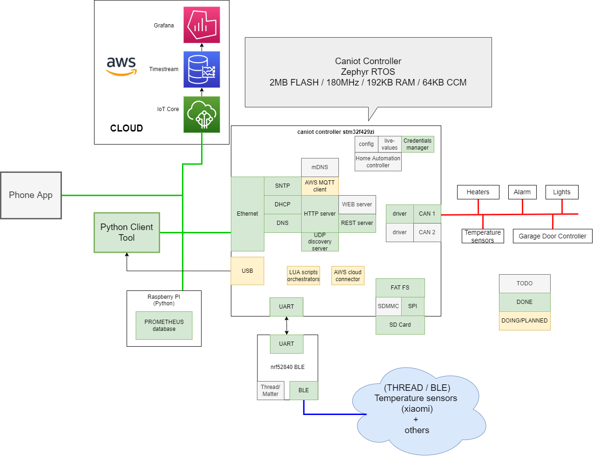
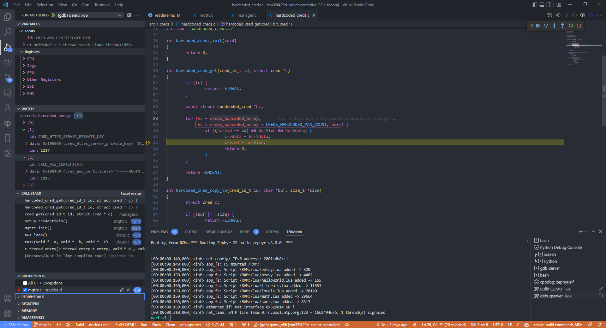

# Home Automation Controller for CAN/BLE devices - with ZephyrRTOS and stm32f4

## Introduction
This project is an attempt to create a home automation controller for CAN/BLE devices.
It serves my personnal needs but I tried to make it somehow generic with reusable components.
This project is far from being finished, it's also a mess but it's a start.
I have a bit more than 1 year of professionnal and personnal experience with Zephyr RTOS. 
And this project can also be seen of a demonstration of an IoT application handling several IoT protocols under Zephyr RTOS.

Currently using **ZephyrRTOS v3.0.0** with following supported boards:
- `nucleo_f429zi`
- `qemu_x86`

But I also aim to build a custom board dedicated to this project.

## Synoptic

Goal is to have a controller able to handle several IoT protocols like CAN, 
BLE (or Thread), Ethernet protocols, etc.. Goal is to gather all the data from
the different devices and send them to a cloud platform (AWS IoT Core for now) or
to a local server (REST, prometheus ..) for monitoring and/or control 
(like heating, lights, alarm etc..).



## AWS - Grafana Dashboard


## Documentation

Documentation is available in the `docs` folder for following topics:

- [HTTP server (REST, Prometheus, file server, webserver)](./docs/http-server.md)
  - [Swagger API for the REST server](./docs/swagger-local-api.yaml)
- [Credentials (AWS IoT, HTTPS server, etc.)](./docs/credentials.md)
- [UDP Discovery Server](./docs/discovery-server.md)
- [User IO (LEDs, buttons, etc.)](./docs/userio.md)
- [Cloud AWS](./docs/cloud-aws.md)
- [Devices & Events model](./docs/devices.md)


- Enabling/disabling features
  - CAN configuration (CANIOT)
  - BLE configuration
  - AWS client
  - LUA
  - ...

## Getting started

### Prerequisites

In order to build this project you need the Zephyr RTOS toolchain. Please refer 
to the [Zephyr RTOS Getting Started Guide](https://docs.zephyrproject.org/latest/getting_started/index.html).

I advice to use a Linux machine for this project, Zephyr SDK should now be
available for Windows but I didn't try it yet. I personally use a Fedora 36
virtual machine.

This project is entirely compliant with the Zephyr RTOS tooling like `west`, 
the `Zephyr SDK`, `Zephyr net-tools` (`twister` in the future).

### Get the project

Let's suppose you are in your home directory : `cd ~`

The project contains a [west.yml](./west.yml) file, you can clone the project using `west`:

    west init -m git@github.com:lucasdietrich/zephyr-caniot-controller.git zephyr-caniot-workspace
    cd zephyr-caniot-workspace
    west update

Finally initialize application submodules (should be enhanced in the future):

    cd zephyr-caniot-controller
    git submodule update --init --recursive

Once you have created the workspace you should have the following file structure:

```
[lucas@fedora zephyr-caniot-workspace]$ tree -L 1
.
├── bootloader
├── modules
├── stm32f429zi-caniot-controller
├── tools
└── zephyr
```

I also advice to create a python virtual environment in your workspace:

    cd ~/zephyr-caniot-workspace
    python3 -m venv .venv
    source .venv/bin/activate

Then install Zephyr RTOS and application requirements:
    pip install -r zephyr/scripts/requirements.txt
    pip install -r zephyr-caniot-controller/requirements.txt


## Configure the project

Once you have cloned the project, go to the application directory `cd zephyr-caniot-controller` :

Configuration is the result of several files:
- Root [prj.conf](./prj.conf) file contains the configuration common to all boards.
- [boards/nucleo_f429zi.conf](./boards/nucleo_f429zi.conf) and [boards/qemu_x86.conf](./boards/qemu_x86.conf)
files contain the configuration specific to each board.
- Finally [overlays/](./overlays/) contains specific configuration to enable features.

If you want to enable a feature, you need to add the corresponding overlay file 
to the `OVERLAY_CONFIG` cmake variable, as follows, for further details please refer 
to [this Makefile](./Makefile).

    west build -b nucleo_f429zi -- -DOVERLAY_CONFIG="overlays/f429zi_shell.conf"

You may want to enable a specific feature, to do so, set `-DOVERLAY_CONFIG` 

If you're using features that requires credentials (like HTTPS server of AWS IoT),
please refer to the [docs/credentials.md](./docs/credentials.md) documentation.

### Build the project

To build the project, make sure you have activated the Python virtual environment 
with `source ../.venv/bin/activate`, then run the following command (for `nucleo_f429zi`):

    west build -b nucleo_f429zi

For `qemu_x86`:

    west build -b qemu_x86

If compilation is successful, you should get following output, for `nucleo_f429zi`:
```
Memory region         Used Size  Region Size  %age Used
           FLASH:      502356 B         1 MB     47.91%
            SRAM:      125878 B       192 KB     64.02%
             CCM:         64 KB        64 KB    100.00%
        IDT_LIST:          0 GB         2 KB      0.00%
```    

In case of error, please refer to the troubleshooting section below.

### Flash and run (Nucleo F429ZI)

With west simply flash with `west flash`

### Run in QEMU with Networking (TAP)

If you want to run the application on QEMU with networking, more configuration is required.
- Clone `git clone zephyrproject-rtos/net-tools` in your zephyr workspace (`zedpyr-caniot-workspace`).
- Build the tools with `cd net-tools && make`

The tools are now available to the scripts located in [scripts/](./scripts/)

The script [scripts/prepareqemunet.sh](./scripts/prepareqemunet.sh) prepare
the networking configuration for QEMU. But please refer to the official documentation
for further details : [Networking with QEMU](https://docs.zephyrproject.org/3.0.0/guides/networking/qemu_setup.html)

So open a terminal and launch the script (not as sudo):

    ./scripts/prepareqemunet.sh

You should see the created `tap0` interface
```
[lucas@fedora stm32f429zi-caniot-controller]$ ifconfig
tap0: flags=4163<UP,BROADCAST,RUNNING,MULTICAST>  mtu 1500
        inet 192.0.2.2  netmask 255.255.255.0  broadcast 0.0.0.0
        inet6 2001:db8::2  prefixlen 64  scopeid 0x0<global>
        inet6 fe80::c894:12ff:fefa:2cdf  prefixlen 64  scopeid 0x20<link>
        ether ca:94:12:fa:2c:df  txqueuelen 1000  (Ethernet)
        RX packets 159  bytes 15931 (15.5 KiB)
        RX errors 0  dropped 0  overruns 0  frame 0
        TX packets 143  bytes 29149 (28.4 KiB)
        TX errors 0  dropped 0 overruns 0  carrier 0  collisions 0
```

In this guide we are using the TAP interface but there are other options available
as described here [Networking with the host system](https://docs.zephyrproject.org/3.0.0/guides/networking/networking_with_host.html).

Then you can run the application (built for `qemu_x86`) :

    west build -t run

Finally if you want to expose your QEMU HTTP server, you may
configure and run the script [scripts/forward_webserver_ports.sh](./scripts/forward_webserver_ports.sh) :

    ./scripts/forward_webserver_ports.sh

## Debug (VS Code)

Debug can be launch on QEMU targets using `ninja debugserver -C build` command

### Nucleo F429ZI

Debug of the nucleo_f429zi board is done using the ST-Link V2 debugger with OpenOCD.

Use one of the the configurations `Launch cortex-debug nucleo_429zi` and `Attach cortex-debug nucleo_429zi` 
available in the [launch.json](./.vscode/launch.json) file.

If OpenOCD configuration doesn't work try the configuration `BACKUP cortex-debug STutil`, but 
I discourage using it and you will need to install ST-Link utilities.

- Select the configuration
- Then press `F5`


### QEMU x86
Debug of the qemu_x86 board is done using the gdbserver provided by QEMU.

- Run `ninja debugserver -C build` 
- Then use configuration `(gdb) qemu_x86`.
- Then press `F5`


### QEMU ARM (TODO)

With `EXPERIMENTAL (gdb) QEMU ARM` and `LEGACY (gdb) QEMU ARM`

**TODO**

### Agnostic (deprecated)

You can launch debug on any target using the `ninja debugserver -C build` command
with `BACKUP (gdb) Agnostic` configuration. But I advice to use the configuration
specific to the target.

### Wireshark (QEMU)

To see network traffic generated by the application in QEMU, use one of the following commands:
- If you are on a windows host, with your QEMU instance running on a Linux guest, 
run the following command in a git bash terminal:
```
    ssh lucas@fedora sudo tcpdump -U -s0 'not port 22' -i tap0 -w - | "C:\Program Files\Wireshark\Wireshark.exe" -k -i -
```
- If you are on a Linux host, with your QEMU instance running on a Linux guest, use the following command:
```
    ssh lucas@fedora sudo tcpdump -U -s0 'not port 22' -i tap0 -w - | wireshark -k -i -
```
- If your wireshark and QEMU are on the same machine:
```
    sudo tcpdump -U -s0 'not port 22' -i tap0 -w - | wireshark -k -i -
```

---

## Features

- developped, in progress, incoming

- HTTP
  - Concurrent connections (up to 3)
  - Keep-alive support
  - HTTP/HTTPS (TLS 1.2)
  - Chunked encoding for requests (stream)
  - **TODO** Chunked encoding for responses (stream)
  - REST server base
  - WEB server base
  - **TODO** Multipart parser
  - Prometheus metrics client
  - **TODO** File download
  - WebServer
- BLE controller
  - Interface: IPC with nrf52840dk
  - Data collector
- CAN controller
  - Interface
  - CANIOT controller
- LUA
  - **TODO** orchestrator
  - **TODO** OS module
  - **TODO** Application programming interface (API)
- Cloud
  - **TODO** AWS IoT 
    - Request/response
    - Device update
    - Device sync with Device Shadow
- Filesystem
  - **PoC** Settings (NVS)
  - RAM FAT FS
  - **PoC** SD FAT FS
  - **TODO** SD FAT FS formatting
- **PoC** HA abstraction layer 
- UDP discovery server
- Userio
  - **PoC** LEDS
  - **PoC** Button
- Stats
  - **TODO** HEAP usage (newlibc)
  - MbedTLS memory usage
  - Stacks usage
- Sensors:
  - I2C Temperature sensor

Other ideas:
- Thread/Matter


## Footprint

Current footprint `nucleo_f429zi` build (debug):
```
Memory region         Used Size  Region Size  %age Used
           FLASH:      498428 B         1 MB     47.53%
            SRAM:      119286 B       192 KB     60.67%
             CCM:         64 KB        64 KB    100.00%
        IDT_LIST:          0 GB         2 KB      0.00%
```

## Demo

 HTTP upload of a LUA script to SD card then execute.
```
somecalc1.lua
1661031779
0.505708
[00:01:32.512,000] <inf> http_server: (4) Connection accepted from 192.168.10.216:54476, cli sock = 7
[00:01:32.514,000] <inf> files_server: Filepath: /SD:/lua/somecalc1.lua
[00:01:32.527,000] <inf> files_server: File /SD:/lua/somecalc1.lua upload succeeded [size = 389]
[00:01:32.528,000] <inf> http_server: (7) Req /files [payload 389 B] returned B resp status 200 [payload 16 B] (keep-alive=0)
[00:01:32.544,000] <inf> http_server: (7) Connection closed by peer
[00:01:32.544,000] <inf> http_server: (7) Closing sock conn 0x20003e54
[00:01:32.545,000] <inf> http_server: (4) Connection accepted from 192.168.10.216:54486, cli sock = 7
[00:01:32.557,000] <dbg> lua: lua_orch_script_handler: (0x20010bb4) Executing script ...
[00:01:32.595,000] <dbg> lua: lua_orch_script_handler: (0x20010bb4) Script returned res=0...
[00:01:32.595,000] <inf> lua: (0x20010bb4) Script returned 0 (LUA_OK)
[00:01:32.596,000] <inf> http_server: (7) Req /lua/execute [payload 0 B] returned B resp status 200 [payload 45 B] (keep-alive=0)
[00:01:32.598,000] <inf> http_server: (7) Connection closed by peer
[00:01:32.598,000] <inf> http_server: (7) Closing sock conn 0x20003e98
```

## Known issues

- MAJOR: SD FAT FS internal state gets corrupted when doing many requests in a short time.
- minor: Fix `-Waddress-of-packed-member` during `xiaomi_dataframe_t` handling
- 

## TODO

- Move several buffers to CCM to keep space in SRAM for Newlib heap (for LUA)
- Allow to embed LUA script when building for `nucleo_f429zi`

## Troubleshooting
- TODO


## Ressources:
- [Zephyr Documentation - West Manifests](https://docs.zephyrproject.org/3.0.0/guides/west/manifest.html)
- TODO Add all the ressources !